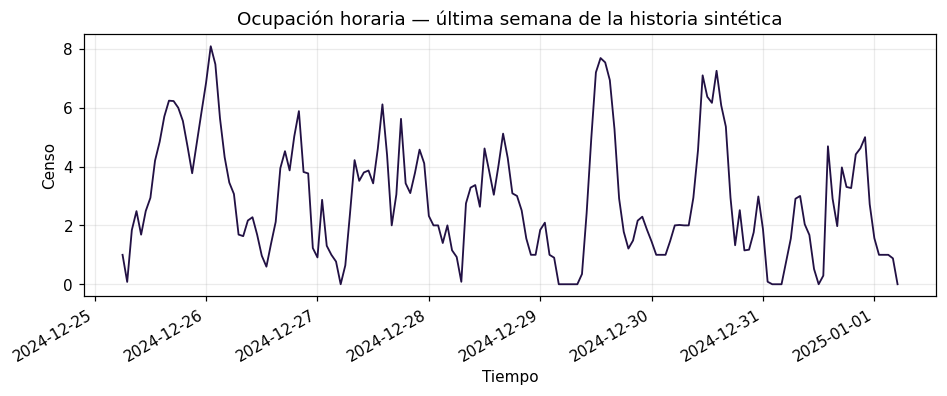
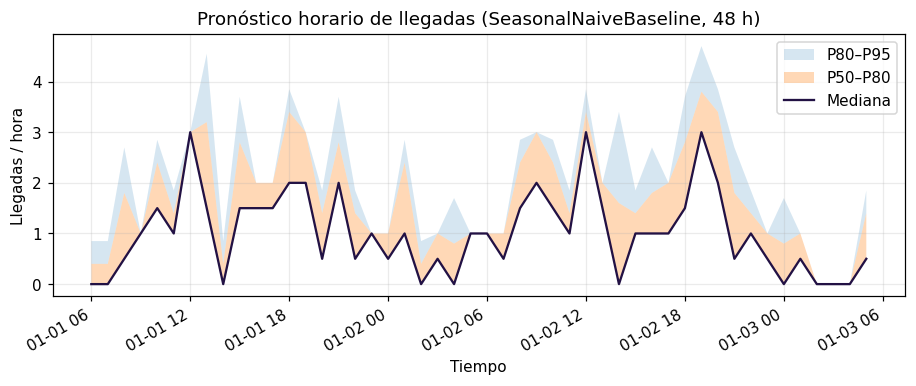
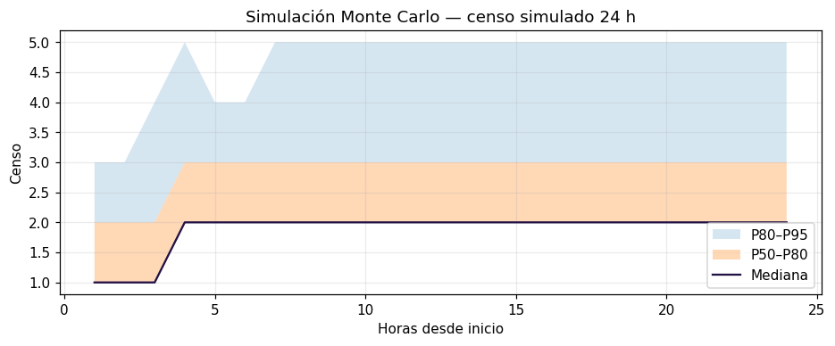
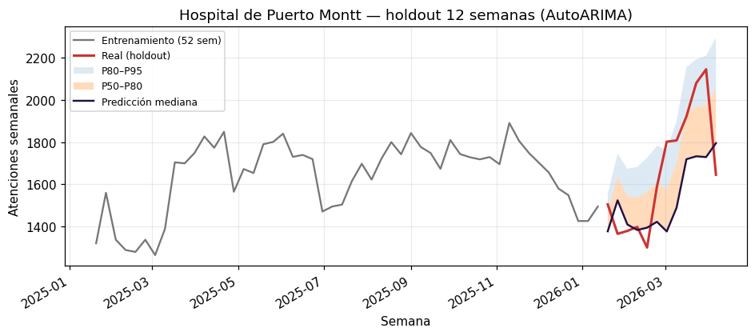
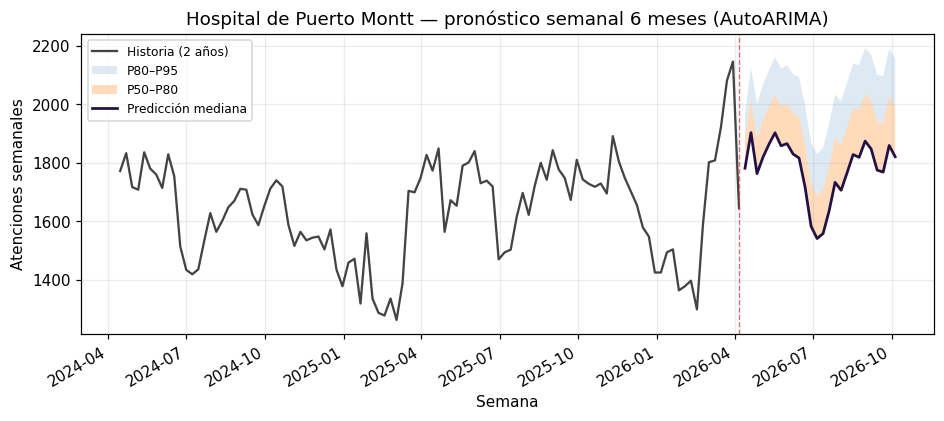
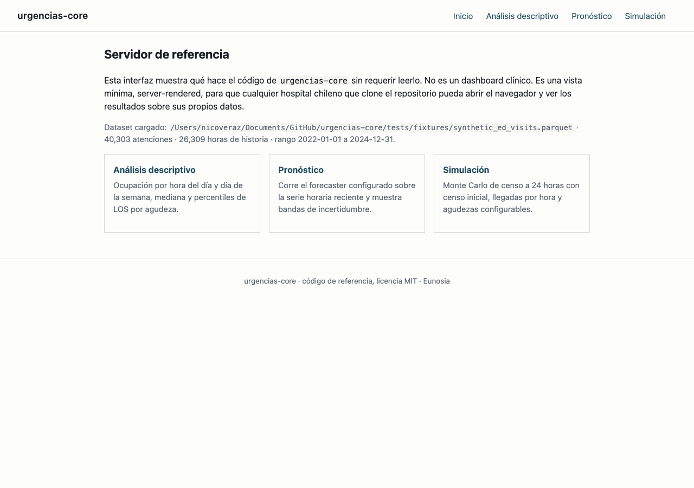
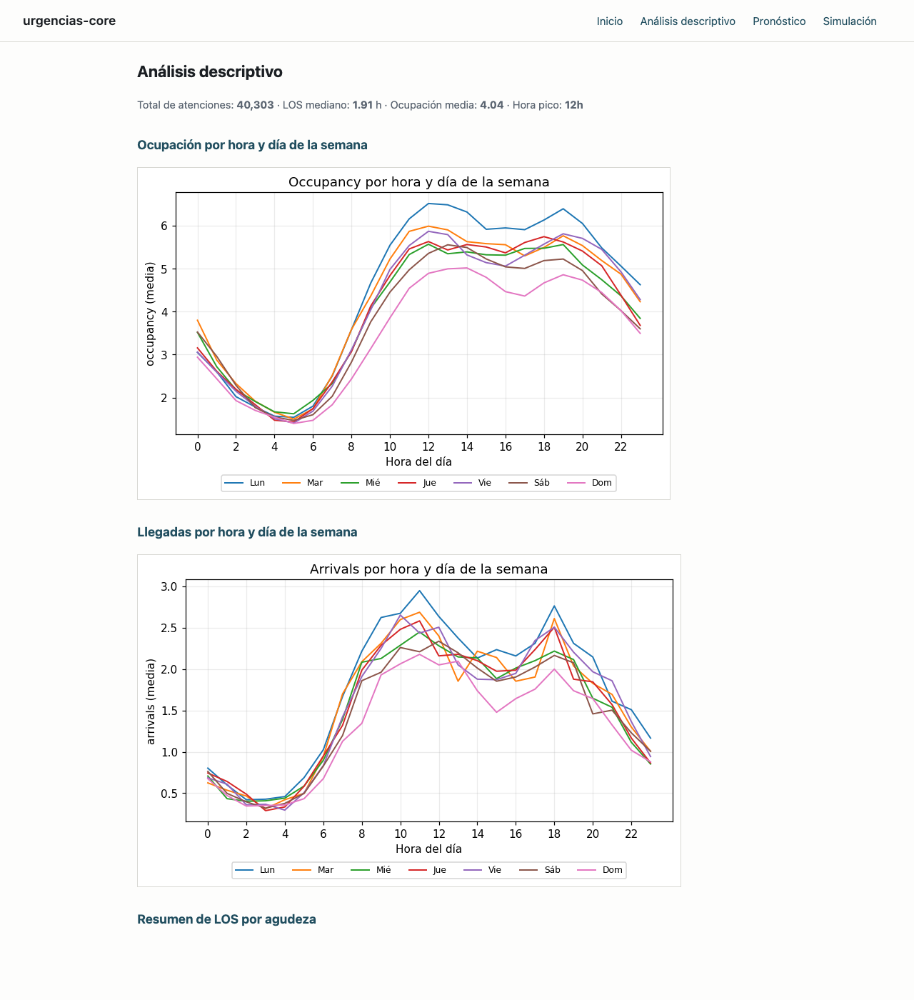
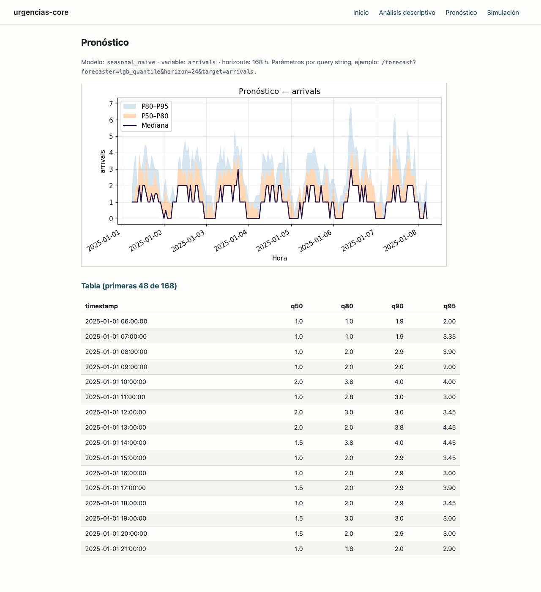
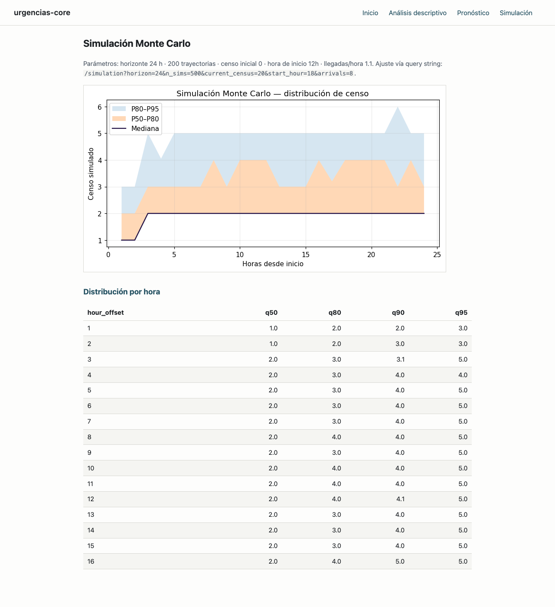

# urgencias-core

Código de referencia para análisis, simulación y forecasting de servicios de
urgencia en Chile. Fundación abierta de **Eunosia**.

## 🚀 Demo en vivo

Sube tu CSV de visitas y obtén un pronóstico rápido de ocupación,
directamente en el navegador, sin instalar nada:

**👉 [nicoveraz.github.io/urgencias-core](https://nicoveraz.github.io/urgencias-core/)**

El demo procesa todo localmente (los datos no salen de tu dispositivo) y
sirve como punto de entrada al tier comercial de Eunosia.

---

## Atribución

`urgencias-core` es la base abierta para el análisis y planificación de
servicios de urgencia en Chile. Desarrollado y mantenido por Nicolás Vera Z.
como fundación de **Eunosia**, una plataforma de IA clínica para medicina de
urgencia. Publicado bajo licencia MIT para la comunidad de salud chilena.

## Qué es / Qué no es

**Qué es:** código de referencia para análisis, simulación y forecasting de
servicios de urgencia en Chile. Implementa transformaciones de datos
visit-level a series temporales horarias, características de calendario
chileno, motor de simulación Monte Carlo de ocupación, línea base de
forecasting estacional, un lector del dataset público DEIS MINSAL, y un
servidor web mínimo para visualización.

**Qué no es:** un paquete pip mantenido. No hay garantías de estabilidad de
API, soporte, ni respuesta a issues. Si te sirve, clónalo, modifícalo,
adáptalo. Si encuentras un bug, un PR es bienvenido pero no prometido.

## Quickstart

```bash
git clone https://github.com/nicoveraz/urgencias-core
cd urgencias-core
uv sync

# Demo sintético: pipeline completo incluyendo simulación.
uv run python scripts/demo_synthetic.py

# Demo DEIS: capa de forecasting sobre datos reales de hospitales chilenos.
uv run python scripts/demo_deis.py

# Servidor de referencia (dashboard mínimo).
uv run uvicorn urgencias_core.server.app:app
```

El demo sintético se ejecuta en segundos contra una fixture incluida en el
repo (~40 000 atenciones, 2022–2024) y genera tres PNG en `outputs/`. El
demo DEIS descarga datos reales (o cae al snapshot offline) y escribe
tablas de backtesting + pronósticos a 6 meses.

## Qué produce el pipeline

Las figuras a continuación provienen de `docs/img/` y son el resultado
directo de correr los dos scripts de demo contra los datos incluidos.

### 1. De atenciones a serie horaria de ocupación

El loader `urgencias_core.data.timeseries` convierte el parquet
visit-level (una fila por atención, con timestamps de ingreso y egreso)
a una serie horaria de censo usando el truco de cumsum de eventos
(+1 al ingreso, –1 al egreso, cumsum reindexado a la grilla horaria).
La figura muestra la última semana de la fixture sintética: un ciclo
diurno claro con valles nocturnos y picos vespertinos, consistentes con
el patrón esperado de una urgencia chilena de tamaño medio.



### 2. Capa de forecasting — pronóstico horario 48 h

Sobre esa misma serie, el baseline `SeasonalNaiveBaseline` produce un
pronóstico horario a 48 horas con intervalos cuantiles P50–P80 y
P80–P95. Para el demo sintético basta este baseline — los modelos más
fuertes (`AutoARIMA`, `AutoETS`, `LGBQuantile`) se comparan en el harness
de evaluación y viven bajo la misma interfaz `Forecaster`.



### 3. Motor de simulación Monte Carlo

El motor `urgencias_core.simulation.engine` toma llegadas futuras
(muestreadas desde el pronóstico) y para cada llegada samplea un LOS
empírico condicional en (agudeza, hora de llegada). Iterando M réplicas
produce bandas de incertidumbre del censo 24 horas hacia adelante —
la base para decisiones de surge y tablas de turnos.



### 4. Datos reales — backtest semanal sobre DEIS

El demo DEIS corre la misma capa de forecasting contra atenciones de
urgencia reales del Hospital de Puerto Montt. El holdout separa las
últimas 12 semanas como test y entrena sobre las 52 previas. La figura
muestra que `AutoARIMA` captura la mediana del alza post-verano 2026
con el verdadero dentro de la banda P80–P95 en la mayoría de las
semanas — evidencia de que el pipeline sintético no está sobreajustado
al régimen de la fixture.



### 5. Pronóstico operacional a 6 meses

Con el modelo validado, el demo reentrena sobre toda la historia y
emite un pronóstico semanal a 26 semanas — el horizonte útil para
planificación de turnos, presupuesto e insumos. La banda P80–P95 se
ensancha con el horizonte, como es de esperar.



### 6. Dashboard de referencia

El servidor FastAPI (`uv run uvicorn urgencias_core.server.app:app`)
expone 4 rutas con los mismos gráficos del pipeline pero vivos en el
navegador. Es deliberadamente minimal — Jinja2 + matplotlib embebido
como base64, sin JavaScript. Pensado como punto de partida para que un
hospital lo clone y adapte.

<p align="center">


</p>
<p align="center">


</p>

De izquierda a derecha, arriba abajo: página de inicio, análisis
descriptivo (ocupación y llegadas por hora × día de la semana),
pronóstico con bandas cuantiles, y simulación Monte Carlo del censo
24 horas.

## Qué hay adentro

| Módulo | Para qué sirve |
|---|---|
| `urgencias_core.data.loader` | Lee un parquet visit-level y valida el esquema. |
| `urgencias_core.data.timeseries` | Convierte atenciones a serie horaria (llegadas, altas, ocupación por agudeza, LOS medio) con el truco de cumsum de eventos. |
| `urgencias_core.data.deis` | Cliente del DEIS MINSAL (fetch + caché + filtro a hospitales demo) con fallback offline al snapshot. |
| `urgencias_core.features.calendar` | Festivos `holidays.CL`, días puente, calendario escolar, eventos regionales configurables (Semana Musical de Frutillar por defecto). |
| `urgencias_core.features.weather` | Cliente de Open-Meteo con caché en disco, Puerto Montt por defecto. |
| `urgencias_core.models.protocol` | Protocolo `Forecaster` y `HorizonSpec` (agnóstico del grano: horario, diario, semanal, mensual). |
| `urgencias_core.models.lgb_quantile` | LightGBM quantile regression, un modelo por cuantil, features de calendario. |
| `urgencias_core.eval.baselines` | `SeasonalNaiveBaseline` + envoltorios de `statsforecast` (AutoARIMA, AutoETS, AutoTheta, MSTL). |
| `urgencias_core.eval.harness` | Evaluación side-by-side con regla de advertencia ≥5% (un modelo que no supera a los baselines no debería producir). |
| `urgencias_core.simulation.los_empirical` | Muestreador empírico de LOS condicional en (agudeza, hora de llegada). |
| `urgencias_core.simulation.engine` | Simulación Monte Carlo de censo forward 24 horas. |
| `urgencias_core.server` | Servidor FastAPI mínimo (4 rutas, Jinja2, matplotlib base64, sin JS). |

## Datos públicos: DEIS MINSAL

El demo DEIS usa datos abiertos del Departamento de Estadísticas e
Información de Salud del Ministerio de Salud ([deis.minsal.cl](https://deis.minsal.cl/#datosabiertos))
para dos hospitales del Servicio de Salud Reloncaví:

- **Hospital de Puerto Montt** (código DEIS 24-105, alta complejidad).
  Conocido localmente como Hospital Base de Puerto Montt.
- **Hospital de Frutillar** (código DEIS 24-115, baja complejidad).

DEIS publica esta serie desde 2008 hasta el presente. El archivo del año en
curso se actualiza semanalmente durante la campaña de invierno respiratoria
(marzo–septiembre) y roughly mensualmente fuera de ella. El demo usa
automáticamente el último año disponible al momento de ejecutarse y produce
un pronóstico a 6 meses en el momento de la corrida.

**Por qué estos dos hospitales.** Son centros de referencia regional en Los
Lagos con datos de acceso público. La elección es pragmática y geográfica,
no evaluativa.

**Enmarcamiento estrictamente metodológico.** Esta demostración usa datos
públicos de DEIS MINSAL para mostrar el funcionamiento de las herramientas
de forecasting sobre datos reales de hospitales chilenos. No constituye
una evaluación operacional, clínica ni de calidad de los hospitales
mencionados.

**Atribución y licencia.** Los datos son publicados por DEIS MINSAL bajo
el marco chileno de datos abiertos. Si usa este código o sus derivados
para investigación, mantenga la atribución a DEIS y, cuando sea relevante,
a `urgencias-core`. El snapshot ofline incluido en `tests/fixtures/` es un
extracto filtrado del dataset público para reproducibilidad; no exime al
usuario de fetchar directamente desde la fuente en usos operacionales.

## Decisiones arquitectónicas

Ver [`docs/decisions.md`](docs/decisions.md).

## Hoja de ruta

Ver [`docs/roadmap.md`](docs/roadmap.md) para items diferidos: soporte
para los archivos mdb/xlsx pre-2020 de DEIS, neuralforecast (TFT, NHITS),
integración EMR para separar tiempo de workup del tiempo de boarding.

## Cita informal

Si usas este código, por favor menciona Eunosia y enlaza al repositorio.

## Licencia

MIT. Ver [LICENSE](LICENSE).

---

# urgencias-core (English)

Reference code for Chilean emergency department analytics, simulation, and
forecasting. Open foundation of **Eunosia**.

## 🚀 Live demo

Drop your visit-level CSV and get a quick occupancy forecast, all in the
browser — no install required:

**👉 [nicoveraz.github.io/urgencias-core](https://nicoveraz.github.io/urgencias-core/)**

All processing happens client-side (your data never leaves the device).
The demo is a gateway to Eunosia's commercial tier.

## Attribution

`urgencias-core` is the open foundation for analysis and planning of
emergency departments in Chile. Developed and maintained by Nicolás Vera Z.
as the foundation of **Eunosia**, a clinical AI platform for emergency
medicine. Published under the MIT license for the Chilean health community.

## What it is / What it isn't

**What it is:** reference code for analysis, simulation, and forecasting of
emergency services in Chile. Implements visit-level to hourly time series
transformations, Chilean calendar features, a Monte Carlo occupancy
simulator, a seasonal forecasting baseline, a DEIS MINSAL public-data
loader, and a minimal web server for visualization.

**What it isn't:** a maintained pip package. No API stability guarantees,
no support, no issue-response SLA. If it's useful, clone it, modify it,
adapt it. Bug reports and pull requests are welcome but not promised to
be reviewed quickly.

## Quickstart

```bash
git clone https://github.com/nicoveraz/urgencias-core
cd urgencias-core
uv sync

# Synthetic demo: full pipeline including simulation.
uv run python scripts/demo_synthetic.py

# DEIS demo: forecasting layer on real Chilean hospital data.
uv run python scripts/demo_deis.py

# Reference server (minimal dashboard).
uv run uvicorn urgencias_core.server.app:app
```

The synthetic demo runs in seconds on a fixture shipped with the repo
(~40 000 visits spanning 2022–2024) and writes three PNGs to `outputs/`.
The DEIS demo fetches real public data (or falls back to the bundled
snapshot) and writes backtesting tables and 6-month-ahead forecasts.

## What's inside

Same modules as above; Spanish table applies. Docstrings are in English;
user-facing strings in the server, demo outputs, and fixtures are in
Spanish.

## Public data: DEIS MINSAL

The DEIS demo uses open data from Chile's Ministry of Health Department
of Health Statistics and Information ([deis.minsal.cl](https://deis.minsal.cl/#datosabiertos))
for two hospitals in the Servicio de Salud Reloncaví network: **Hospital
de Puerto Montt** (code 24-105, high-complexity, locally known as
"Hospital Base de Puerto Montt") and **Hospital de Frutillar** (code
24-115, low-complexity).

DEIS publishes this series from 2008 to the present. The current-year
file is updated weekly during the winter respiratory campaign
(March–September) and roughly monthly outside of it. The demo
automatically uses the latest data available at the time of execution
and produces a six-month-ahead forecast.

**Why these two hospitals.** Regional reference centers in Los Lagos with
publicly available data. Chosen on geographic and pragmatic grounds, not
on any evaluation of quality.

**Methodological framing only.** This demo uses public DEIS MINSAL data
to show how the forecasting tools behave on real Chilean hospital data.
It is NOT an operational, clinical, or quality evaluation of either
hospital.

**Attribution and license.** Data published by DEIS MINSAL under Chile's
open data framework. If you use this code or derivatives for research,
maintain DEIS attribution and, where relevant, cite `urgencias-core`. The
offline snapshot in `tests/fixtures/` is a filtered extract of the public
dataset for reproducibility; it does not replace fetching directly from
the source for operational use.

## Architecture decisions

See [`docs/decisions.md`](docs/decisions.md).

## Roadmap

See [`docs/roadmap.md`](docs/roadmap.md) for deferred items: xlsx/mdb
support for DEIS 2017–2019 publications, neuralforecast (TFT, NHITS),
EMR integration to separate workup time from boarding time.

## Informal citation

If you use this code, please mention Eunosia and link back.

## License

MIT. See [LICENSE](LICENSE).
